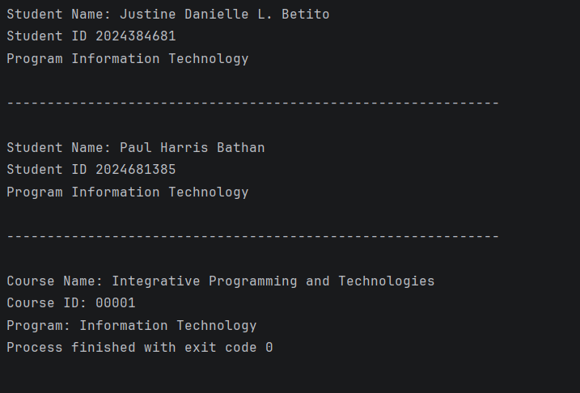
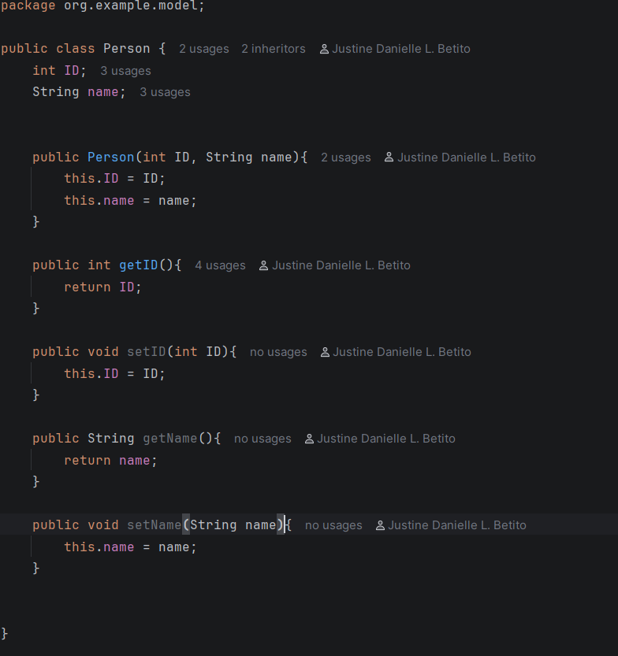
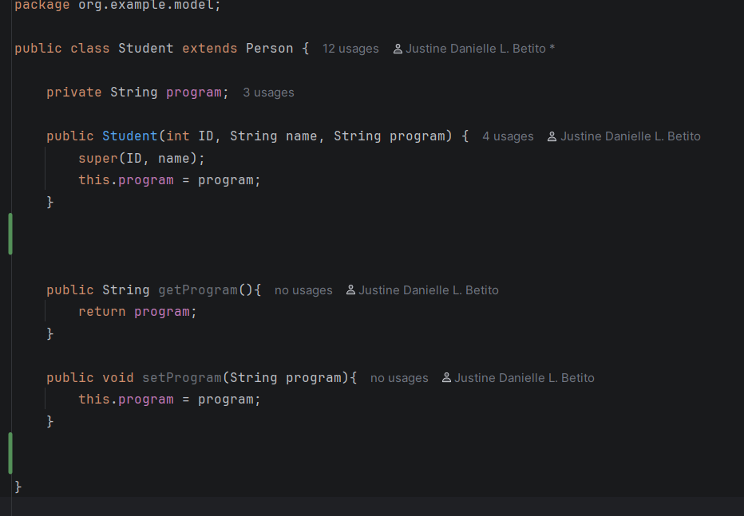
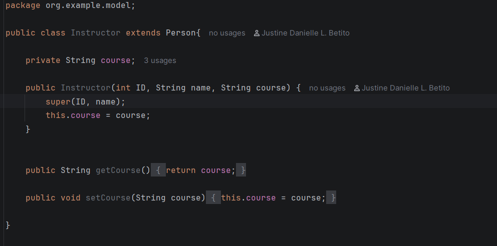
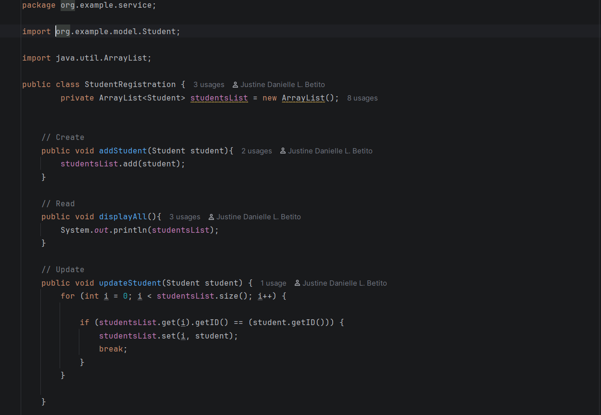
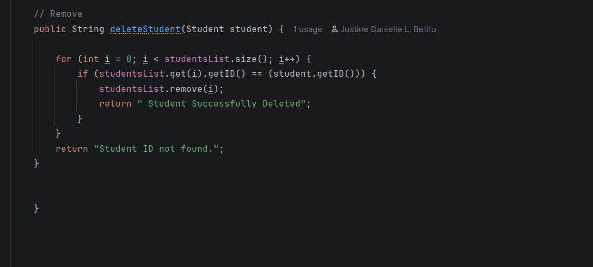

# OOP-Enrollment-System

---

**Author**: Justine Danielle L. Betito

**1. Decription**

it's all about encapsulation

[]

**2. Description**

Inheritance Activity:

Concrete Class

Subclass

Subclass

Service

**3. Description**

Abstract Activity Screenshot Person Class

